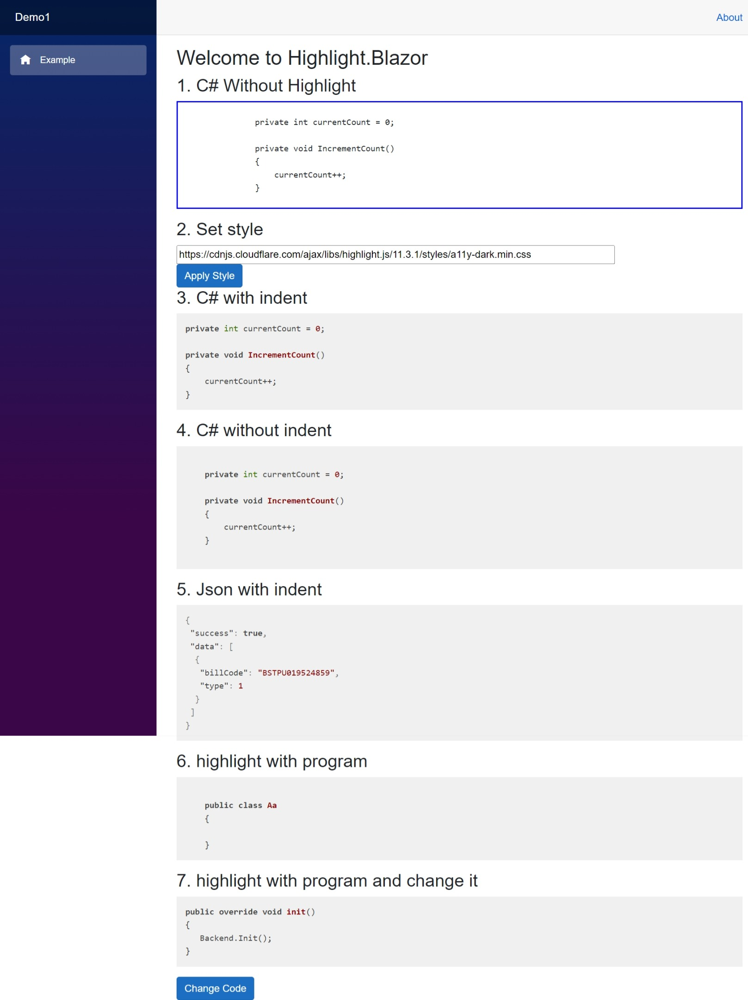
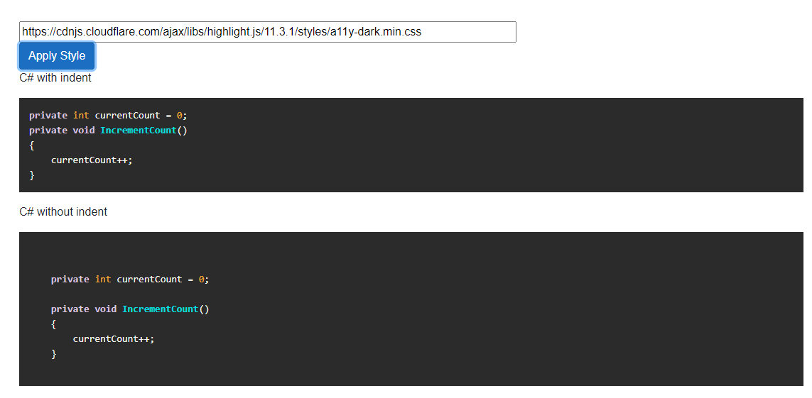

# Highlight.Blazor
Syntax highlighting for Blazor, based on [highlight.js](https://highlightjs.org/)

| Build | NuGet |
|--|--|
||[](https://www.nuget.org/packages/HighlightBlazor)|




# How to use
You can install the package via the NuGet package manager just search for *Highlight.Blazor*.


## 1. Add Imports
Add the following to your *_Imports.razor*

```csharp
@using HighlightBlazor
```


## 2. Add reference to style sheet(s)
Add the following line to the `head` tag of your `_Host.cshtml` (Blazor Server app) or `index.html` (Blazor WebAssembly).
```
<link href="_content/HighlightBlazor/highlight-blazor-styles.css" rel="stylesheet">
<script src="_content/HighlightBlazor/highlight-blazor.js"></script>
```
These files include the js and default style of highlight.js.

## 3. Add Serivce (optional)

You need to register the highlight services if you want to set the code style.
```csharp
builder.Services.AddHighlight();
```


## 4. Happy to use
### 4.1 C# without Highlight
```html
<pre>
    <code>
                private int currentCount = 0;

                private void IncrementCount()
                {
                    currentCount++;
                }
    </code>
</pre>
```
### 4.2 C# with indent
```html
        <CodeHighlight>
                private int currentCount = 0;

                private void IncrementCount()
                {
                    currentCount++;
                }
        </CodeHighlight>
```
### 4.3 C# without indent
```html
        <CodeHighlight Indent="false">
                private int currentCount = 0;

                private void IncrementCount()
                {
                    currentCount++;
                }
        </CodeHighlight>
```
### 4.4 Json with indent
```html
        <CodeHighlight Indent="true" CodeLanguage="json">
                    {
	                    "success": true,
	                    "data": [
		                    {
			                    "billCode": "BSTPU019524859",
			                    "type": 1
		                    }
	                    ]
                    }
        </CodeHighlight>
```
### 4.5 Highlight by program
```html
<CodeHighlight>@SourceCode</CodeHighlight>

@code {
    string SourceCode = @"
    public class Aa
    {
    
    }
";

}
```
**note**:
`<CodeHighlight>@SourceCode</CodeHighlight>`
and
```
<CodeHighlight>
    @SourceCode
</CodeHighlight>
```
has different render style. The second one cause more blanks and empty lines.

### 4.6 Change the code in program
```html
<CodeHighlight Code=@AnotherCode></CodeHighlight>
```
```csharp
private void ChangeCode()
{
    Random r = new Random();
    AnotherCode = "public override void init_" + r.Next(0,100) + "()\n{\n   Backend.Init();\n}";
}
```
**Use** `Code=@AnotherCode` instead of `<CodeHighlight>@AnotherCode</CodeHighlight>`, or it won't render immediately.

## Supported Languages
Same to highlight.js. See [here](https://github.com/highlightjs/highlight.js/blob/main/SUPPORTED_LANGUAGES.md).

You can set language by `CodeLanguage` property, the default is empty, it means **auto detect**.

## Supported Code Styles


You can set different styles by `HighlightService`.

```html
@inject HighlightService highlightSrv

<div>
    <input type="text" @bind-value="styleUrl" style="width:700px" />
</div>

<button class="btn btn-primary" @onclick="ApplyStyle">Apply Style</button>

@code {
    private string styleUrl = "https://cdnjs.cloudflare.com/ajax/libs/highlight.js/11.3.1/styles/a11y-dark.min.css";

    private void ApplyStyle()
    {
        highlightSrv.SetStyleAsync(styleUrl);
    }
}
```

Full supported styles list, you can see [here](https://cdnjs.com/libraries/highlight.js).

## Indent
By set `Indent` to `false`, it can display the origin code. Default is `true`.


